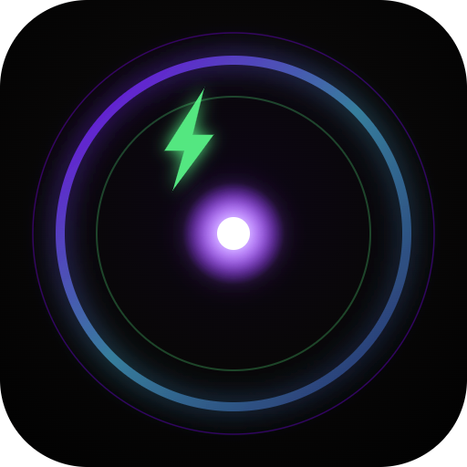

  

<h1 align="center">ExoVoid</h1>

  A deep, true-black theme pack built for OLED screens and editor background/wallpaper images — now with five Classic Syntax color variants.

## Themes included

| Theme | Description |
| --- | --- |
| **ExoVoid** | The flagship theme — near-black backgrounds with a vivid purple accent, tuned for OLED panels and transparent/wallpaper editor backgrounds. |
| **ExoVoid Classic Syntax - Dark Soft Blue** | Classic syntax highlighting on an OLED-black UI with a cool soft-blue accent. |
| **ExoVoid Classic Syntax - Forest Green** | Classic syntax highlighting with a calming forest-green accent. |
| **ExoVoid Classic Syntax - Magenta** | Classic syntax highlighting with a bold magenta accent. |
| **ExoVoid Classic Syntax - Rust Red** | Classic syntax highlighting with a warm rust-red accent. |
| **ExoVoid Classic Syntax - Yellow** | Classic syntax highlighting with a bright yellow accent. |

## Why ExoVoid?

- **True black backgrounds** — saves power and reduces eye strain on OLED displays.
- **Wallpaper-friendly** — low-opacity UI layers are designed to work well with custom editor background images.
- **Six variants, one install** — pick the flagship purple look or one of five Classic Syntax color accents to match your mood.

## Getting started

1. Install the **ExoVoid** extension from the VS Code Marketplace.
2. Open the Command Palette (`Ctrl+Shift+P` / `Cmd+Shift+P`) and run **Preferences: Color Theme**.
3. Choose any of the ExoVoid themes listed above.

## Contributing

Issues and pull requests are welcome on the [GitHub repository](https://github.com/gpioloco/ExoVoid).

## License

MIT
